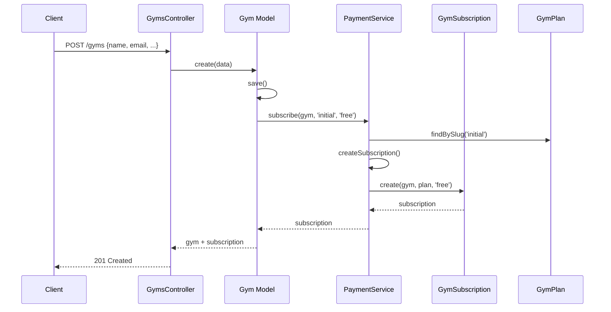
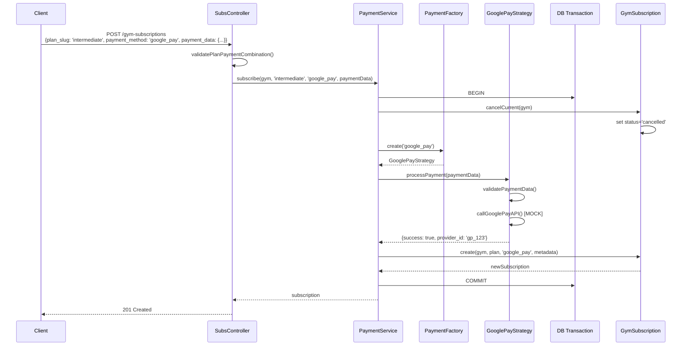
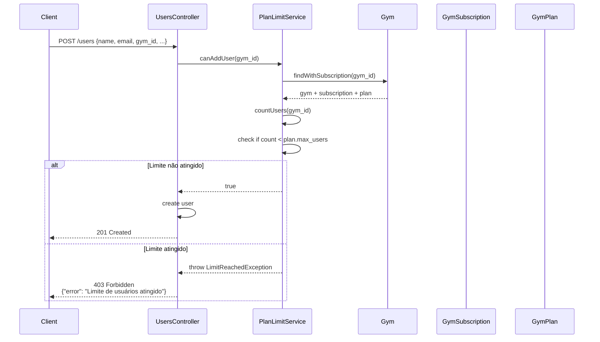
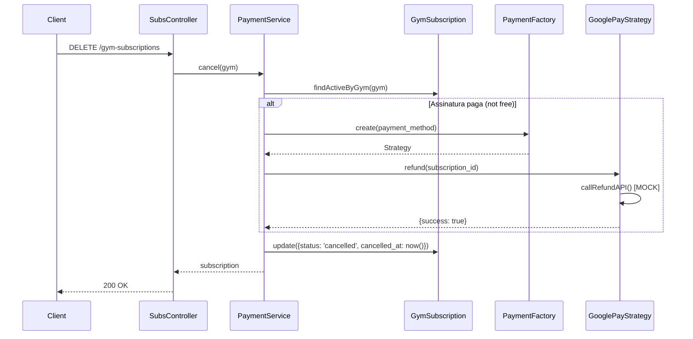

# 💳 Sistema de Pagamento e Planos - Gym API

## Documentação Completa do Sistema de Planos e Assinaturas

> **Versão:** 1.0  
> **Status:** ✅ Implementado e Refatorado  
> **Padrão de Design:** Strategy + Registry Pattern

---

## 📑 Índice

1. [Visão Geral](#-visão-geral)
2. [Arquitetura](#-arquitetura)
3. [Planos Disponíveis](#-planos-disponíveis)
4. [Modelos de Dados](#-modelos-de-dados)
5. [Fluxos de Operação](#-fluxos-de-operação)
6. [Provedores de Pagamento](#-provedores-de-pagamento)
7. [APIs e Endpoints](#-apis-e-endpoints)
8. [Serviços](#-serviços)
9. [Como Adicionar Novo Provedor](#-como-adicionar-novo-provedor)
10. [Configuração](#-configuração)
11. [Segurança](#-segurança)
12. [Limitações e TODOs](#-limitações-e-todos)

---

## 🎯 Visão Geral

O sistema de pagamento da Gym API permite que academias (gyms) assinem planos com diferentes níveis de recursos, incluindo limite de usuários. O sistema foi projetado para ser **extensível** e **desacoplado**, permitindo fácil adição de novos provedores de pagamento.

### Características Principais

- ✅ **Multi-tenant**: Cada academia tem sua própria assinatura independente
- ✅ **Três planos**: Inicial (gratuito), Intermediário, Ilimitado
- ✅ **Múltiplos provedores**: Google Pay, Apple Pay, Plano Gratuito
- ✅ **Extensível**: Strategy + Registry Pattern para adicionar novos provedores
- ✅ **Limites de recursos**: Controle de quantidade máxima de usuários por plano
- ✅ **Assinatura automática**: Novas academias recebem plano inicial gratuito
- ✅ **Transações atômicas**: Operações críticas protegidas com database transactions
- ✅ **Type-safe**: Constantes tipadas eliminam magic strings

---

## 🏗️ Arquitetura

### Diagrama de Componentes

```
┌────────────────────────────────────────────────────────────────┐
│                     GYM SUBSCRIPTION SYSTEM                     │
└────────────────────────────────────────────────────────────────┘

┌──────────────────────┐
│   Controllers        │
│  ┌────────────────┐  │
│  │ GymPlansCtrl   │  │  (HTTP Layer)
│  │ GymSubsCtrl    │  │
│  └────────────────┘  │
└──────────┬───────────┘
           │
┌──────────▼───────────┐
│   Services           │
│  ┌────────────────┐  │
│  │ PaymentService │──────┐  (Business Logic)
│  │ PlanLimitSvc   │      │
│  └────────────────┘      │
└──────────┬───────────────┘
           │                │
┌──────────▼───────────┐    │
│   Payment Strategies │◄───┘
│  ┌────────────────┐  │
│  │ PaymentFactory │  │  (Strategy + Registry Pattern)
│  │  (Registry)    │  │
│  └────────┬───────┘  │
│           │          │
│  ┌────────▼───────┐  │
│  │FreePlanStrategy│  │  (Concrete Strategies)
│  │GooglePayStrat  │  │
│  │ApplePayStrat   │  │
│  └────────────────┘  │
└──────────┬───────────┘
           │
┌──────────▼───────────┐
│   Models             │
│  ┌────────────────┐  │
│  │ GymPlan        │  │  (Data Layer)
│  │ GymSubscription│  │
│  │ Gym            │  │
│  └────────────────┘  │
└──────────────────────┘
```

### Padrões de Design

#### 1. **Strategy Pattern**

Cada provedor de pagamento implementa a interface `PaymentStrategy`:

```typescript
interface PaymentStrategy {
  processPayment(data: PaymentData): Promise<PaymentResult>
  validatePaymentData(data: any): boolean
  refund(subscriptionId: number): Promise<RefundResult>
  isConfigured(): boolean
}
```

**Benefícios:**
- Adicionar novos provedores sem modificar código existente (Open/Closed Principle)
- Cada estratégia encapsula sua própria lógica
- Testabilidade: mock de estratégias individuais

#### 2. **Registry Pattern (Factory)**

O `PaymentFactory` gerencia o registro e criação de estratégias:

```typescript
class PaymentFactory {
  private static strategies = new Map<string, PaymentStrategy>()
  
  static register(method: string, strategy: PaymentStrategy): void
  static create(method: string): PaymentStrategy
  static getSupportedMethods(): string[]
  static getConfiguredMethods(): string[]
}
```

**Benefícios:**
- Ponto único de acesso a estratégias
- Descoberta dinâmica de provedores disponíveis
- Validação centralizada de provedores configurados

---

## 📦 Planos Disponíveis

### Plano Inicial (Free)

```typescript
{
  name: "Plano Inicial",
  slug: "initial",
  price: 0.00,
  max_users: 25,
  features: {
    user_limit: 25,
    trainings: true,
    diets: true,
    products: true
  }
}
```

- **Preço**: R$ 0,00/mês
- **Limite**: 25 usuários
- **Recursos**: Treinos, Dietas, Produtos
- **Renovação**: Automática (sem cobrança)
- **Público-alvo**: Academias pequenas, teste do sistema

### Plano Intermediário

```typescript
{
  name: "Plano Intermediário",
  slug: "intermediate",
  price: 50.00,
  max_users: 100,
  features: {
    user_limit: 100,
    trainings: true,
    diets: true,
    products: true,
    priority_support: false
  }
}
```

- **Preço**: R$ 50,00/mês
- **Limite**: 100 usuários
- **Recursos**: Treinos, Dietas, Produtos
- **Renovação**: Mensal (cobrança automática)
- **Público-alvo**: Academias de médio porte

### Plano Ilimitado

```typescript
{
  name: "Plano Ilimitado",
  slug: "unlimited",
  price: 100.00,
  max_users: null,
  features: {
    unlimited_users: true,
    trainings: true,
    diets: true,
    products: true,
    priority_support: true,
    custom_branding: false
  }
}
```

- **Preço**: R$ 100,00/mês
- **Limite**: Ilimitado
- **Recursos**: Todos + Suporte Prioritário
- **Renovação**: Mensal (cobrança automática)
- **Público-alvo**: Grandes academias, redes

### Comparação de Planos

| Recurso | Inicial | Intermediário | Ilimitado |
|---------|---------|---------------|-----------|
| **Preço** | Grátis | R$ 50/mês | R$ 100/mês |
| **Usuários** | 25 | 100 | ∞ |
| **Treinos** | ✅ | ✅ | ✅ |
| **Dietas** | ✅ | ✅ | ✅ |
| **Produtos** | ✅ | ✅ | ✅ |
| **Suporte Prioritário** | ❌ | ❌ | ✅ |
| **Branding Customizado** | ❌ | ❌ | ❌* |

*Recurso planejado para versão futura

---

## 🗄️ Modelos de Dados

### GymPlan

**Arquivo**: [app/models/gym_plan.ts](../app/models/gym_plan.ts)

```typescript
class GymPlan extends BaseModel {
  @column({ isPrimary: true })
  declare id: number

  @column()
  declare name: string

  @column()
  declare slug: string // 'initial' | 'intermediate' | 'unlimited'

  @column()
  declare price: number // Decimal(10,2)

  @column()
  declare maxUsers: number | null // null = ilimitado

  @column()
  declare features: Record<string, any> // JSON

  @column()
  declare isActive: boolean

  // Helper Methods
  hasFeature(key: string): boolean
  getFeature<T = any>(key: string): T | undefined
  isFree(): boolean
  hasUserLimit(): boolean
}
```

**Métodos Auxiliares:**
- `hasFeature(key)`: Verifica se plano possui recurso
- `getFeature<T>(key)`: Retorna valor tipado do recurso
- `isFree()`: Verifica se plano é gratuito
- `hasUserLimit()`: Verifica se plano tem limite de usuários

### GymSubscription

**Arquivo**: [app/models/gym_subscription.ts](../app/models/gym_subscription.ts)

```typescript
class GymSubscription extends BaseModel {
  @column({ isPrimary: true })
  declare id: number

  @column()
  declare gymId: number

  @column()
  declare planId: number

  @column()
  declare status: string // 'active' | 'cancelled' | 'past_due'

  @column()
  declare paymentMethod: string // 'free' | 'google_pay' | 'apple_pay'

  @column()
  declare paymentProvider: string | null

  @column()
  declare paymentProviderId: string | null

  @column()
  declare paymentMetadata: Record<string, any> | null // JSON

  @column.dateTime()
  declare startedAt: DateTime

  @column.dateTime()
  declare endsAt: DateTime | null

  @column.dateTime()
  declare cancelledAt: DateTime | null

  // Relationships
  @belongsTo(() => Gym)
  declare gym: BelongsTo<typeof Gym>

  @belongsTo(() => GymPlan)
  declare plan: BelongsTo<typeof GymPlan>

  // Helper Methods
  isActive(): boolean
  isCancelled(): boolean
  isPastDue(): boolean
  isFree(): boolean
}
```

**Métodos Auxiliares:**
- `isActive()`: Verifica se assinatura está ativa
- `isCancelled()`: Verifica se foi cancelada
- `isPastDue()`: Verifica se pagamento atrasado
- `isFree()`: Verifica se usa plano gratuito

### Relacionamentos

```typescript
// Gym.ts
@hasOne(() => GymSubscription)
declare subscription: HasOne<typeof GymSubscription>

// Uso:
const gym = await Gym.query().preload('subscription', (query) => {
  query.preload('plan')
}).firstOrFail()

console.log(gym.subscription.plan.name) // "Plano Intermediário"
```

---

## 🔄 Fluxos de Operação

### Fluxo 1: Criação de Nova Academia



**Código:**

```typescript
// GymsController.store()
const gym = await Gym.create(data)
await paymentService.subscribe(gym, PLAN_SLUGS.INITIAL, PAYMENT_METHODS.FREE)
await gym.load('subscription')
return gym
```

### Fluxo 2: Upgrade de Plano (Free → Paid)



**Código:**

```typescript
// GymSubscriptionsController.store()
const paymentData = request.input('payment_data')
const subscription = await paymentService.subscribe(
  gym,
  plan_slug,
  payment_method,
  paymentData
)
return subscription
```

### Fluxo 3: Validação de Limite de Usuários



**Código:**

```typescript
// UsersController.store()
const canAdd = await planLimitService.canAddUser(gym_id)
if (!canAdd) {
  throw new LimitReachedException('Limite de usuários atingido para o plano atual')
}
const user = await User.create(data)
```

### Fluxo 4: Cancelamento de Assinatura



---

## 💳 Provedores de Pagamento

### Estrutura de Provider

Todos os provedores implementam a interface `PaymentStrategy`:

```typescript
// app/services/payment/payment_strategy.ts
export interface PaymentStrategy {
  /**
   * Processa um pagamento
   * @throws Error se pagamento falhar
   */
  processPayment(data: PaymentData): Promise<PaymentResult>

  /**
   * Valida dados de pagamento antes de processar
   */
  validatePaymentData(data: any): boolean

  /**
   * Faz refund/estorno de pagamento
   */
  refund(subscriptionId: number): Promise<RefundResult>

  /**
   * Verifica se provider está configurado (credenciais, etc)
   */
  isConfigured(): boolean
}
```

### 1. FreePlanStrategy

**Arquivo**: [app/services/payment/free_plan_strategy.ts](../app/services/payment/free_plan_strategy.ts)

```typescript
export default class FreePlanStrategy implements PaymentStrategy {
  async processPayment(data: PaymentData): Promise<PaymentResult> {
    return {
      success: true,
      provider: 'free',
      providerId: null,
      metadata: { plan_type: 'free' }
    }
  }

  validatePaymentData(data: any): boolean {
    return true // Plano gratuito não precisa validação
  }

  async refund(subscriptionId: number): Promise<RefundResult> {
    return { success: true, message: 'Plano gratuito não requer estorno' }
  }

  isConfigured(): boolean {
    return true // Sempre disponível
  }
}
```

**Características:**
- ✅ Sempre disponível
- ✅ Sem validação de dados de pagamento
- ✅ Sem necessidade de credenciais
- ✅ Usado automaticamente em novas academias

### 2. GooglePayStrategy

**Arquivo**: [app/services/payment/google_pay_strategy.ts](../app/services/payment/google_pay_strategy.ts)

```typescript
export default class GooglePayStrategy implements PaymentStrategy {
  async processPayment(data: PaymentData): Promise<PaymentResult> {
    if (!this.validatePaymentData(data.paymentData)) {
      throw new Error('Dados de pagamento inválidos para Google Pay')
    }

    // TODO: Integração real com Google Pay API
    // const response = await googlePayClient.processPayment(...)
    
    // MOCK - Desenvolvimento
    return {
      success: true,
      provider: 'google_pay',
      providerId: `gp_${Date.now()}_${Math.random().toString(36).substr(2, 9)}`,
      metadata: {
        mock: true,
        payment_method: 'google_pay',
        amount: data.amount
      }
    }
  }

  validatePaymentData(data: any): boolean {
    return (
      data &&
      typeof data.token === 'string' &&
      data.token.length > 0
    )
  }

  async refund(subscriptionId: number): Promise<RefundResult> {
    // TODO: Implementar refund real
    return {
      success: true,
      message: `Estorno processado para assinatura ${subscriptionId} (MOCK)`
    }
  }

  isConfigured(): boolean {
    // TODO: Verificar credenciais no env
    return true // MOCK - sempre configurado em dev
  }
}
```

**Dados Esperados:**
```typescript
{
  token: string // Token de pagamento do Google Pay
}
```

**Variáveis de Ambiente (Futuro):**
```env
GOOGLE_PAY_MERCHANT_ID=your_merchant_id
GOOGLE_PAY_API_KEY=your_api_key
GOOGLE_PAY_ENVIRONMENT=TEST # ou PRODUCTION
```

### 3. ApplePayStrategy

**Arquivo**: [app/services/payment/apple_pay_strategy.ts](../app/services/payment/apple_pay_strategy.ts)

```typescript
export default class ApplePayStrategy implements PaymentStrategy {
  async processPayment(data: PaymentData): Promise<PaymentResult> {
    if (!this.validatePaymentData(data.paymentData)) {
      throw new Error('Dados de pagamento inválidos para Apple Pay')
    }

    // TODO: Integração real com Apple Pay API
    
    // MOCK - Desenvolvimento
    return {
      success: true,
      provider: 'apple_pay',
      providerId: `ap_${Date.now()}_${Math.random().toString(36).substr(2, 9)}`,
      metadata: {
        mock: true,
        payment_method: 'apple_pay',
        amount: data.amount
      }
    }
  }

  validatePaymentData(data: any): boolean {
    return (
      data &&
      typeof data.payment_token === 'string' &&
      data.payment_token.length > 0
    )
  }

  async refund(subscriptionId: number): Promise<RefundResult> {
    // TODO: Implementar refund real
    return {
      success: true,
      message: `Estorno processado para assinatura ${subscriptionId} (MOCK)`
    }
  }

  isConfigured(): boolean {
    // TODO: Verificar certificados e credenciais
    return true // MOCK - sempre configurado em dev
  }
}
```

**Dados Esperados:**
```typescript
{
  payment_token: string // Token de pagamento do Apple Pay
}
```

**Variáveis de Ambiente (Futuro):**
```env
APPLE_PAY_MERCHANT_ID=merchant.com.yourapp
APPLE_PAY_CERTIFICATE_PATH=/path/to/cert.pem
APPLE_PAY_KEY_PATH=/path/to/key.pem
APPLE_PAY_ENVIRONMENT=sandbox # ou production
```

### Comparação de Providers

| Provider | Status | Configuração | Dados Requeridos | Refund |
|----------|--------|--------------|------------------|--------|
| **Free** | ✅ Pronto | Nenhuma | Nenhum | N/A |
| **Google Pay** | 🚧 Mock | API Key + Merchant ID | `{token: string}` | ✅ Suportado |
| **Apple Pay** | 🚧 Mock | Certificados + Merchant ID | `{payment_token: string}` | ✅ Suportado |

---

## 🌐 APIs e Endpoints

### GymPlans (Público)

#### `GET /gym-plans`
Lista todos os planos disponíveis (públicos).

**Autorização**: Nenhuma (público)

**Resposta**:
```json
[
  {
    "id": 1,
    "name": "Plano Inicial",
    "slug": "initial",
    "price": "0.00",
    "max_users": 25,
    "features": {
      "user_limit": 25,
      "trainings": true,
      "diets": true,
      "products": true
    },
    "is_active": true
  },
  {
    "id": 2,
    "name": "Plano Intermediário",
    "slug": "intermediate",
    "price": "50.00",
    "max_users": 100,
    "features": {
      "user_limit": 100,
      "trainings": true,
      "diets": true,
      "products": true
    },
    "is_active": true
  }
]
```

#### `GET /gym-plans/:id`
Detalhes de um plano específico.

**Autorização**: Nenhuma (público)

**Resposta**:
```json
{
  "id": 2,
  "name": "Plano Intermediário",
  "slug": "intermediate",
  "price": "50.00",
  "max_users": 100,
  "features": {
    "user_limit": 100,
    "trainings": true,
    "diets": true,
    "products": true
  },
  "is_active": true
}
```

---

### GymSubscriptions (Autenticado)

#### `GET /gym-subscriptions`
Retorna assinatura atual da academia do usuário logado.

**Autorização**: Bearer Token (qualquer role aprovado)

**Resposta**:
```json
{
  "id": 15,
  "gym_id": 3,
  "plan_id": 2,
  "status": "active",
  "payment_method": "google_pay",
  "payment_provider": "google_pay",
  "payment_provider_id": "gp_1234567890_abc",
  "payment_metadata": {
    "mock": true,
    "amount": 50.0
  },
  "started_at": "2024-01-15T10:30:00.000Z",
  "ends_at": "2024-02-15T10:30:00.000Z",
  "cancelled_at": null,
  "plan": {
    "id": 2,
    "name": "Plano Intermediário",
    "slug": "intermediate",
    "price": "50.00",
    "max_users": 100
  }
}
```

#### `POST /gym-subscriptions`
Cria nova assinatura (upgrade/downgrade de plano).

**Autorização**: Bearer Token (apenas `admin` ou `super`)

**Body**:
```json
{
  "plan_slug": "intermediate",
  "payment_method": "google_pay",
  "payment_data": {
    "token": "gp_token_abc123xyz"
  }
}
```

**Validações**:
- ❌ Plano gratuito (`initial`) só aceita `payment_method: 'free'`
- ❌ Planos pagos não aceitam `payment_method: 'free'`
- ✅ `plan_slug` deve existir na tabela `gym_plans`
- ✅ `payment_method` deve ser suportado pelo sistema
- ✅ `payment_data` deve conter campos requeridos pelo provider

**Resposta** (201 Created):
```json
{
  "id": 16,
  "gym_id": 3,
  "plan_id": 2,
  "status": "active",
  "payment_method": "google_pay",
  "payment_provider": "google_pay",
  "payment_provider_id": "gp_1234567890_xyz",
  "started_at": "2024-01-20T14:00:00.000Z",
  "ends_at": "2024-02-20T14:00:00.000Z"
}
```

**Erros**:
```json
// 400 Bad Request - Validação falhou
{
  "errors": [
    {
      "field": "payment_method",
      "message": "Plano gratuito só aceita método de pagamento 'free'"
    }
  ]
}

// 403 Forbidden - Limite atingido
{
  "error": "Sua assinatura atual não permite adicionar mais usuários"
}

// 422 Unprocessable Entity - Pagamento falhou
{
  "error": "Falha ao processar pagamento: Token inválido"
}
```

#### `DELETE /gym-subscriptions`
Cancela assinatura atual (com refund se aplicável).

**Autorização**: Bearer Token (apenas `admin` ou `super`)

**Resposta** (200 OK):
```json
{
  "id": 16,
  "gym_id": 3,
  "status": "cancelled",
  "cancelled_at": "2024-01-25T09:15:00.000Z",
  "message": "Assinatura cancelada com sucesso"
}
```

---

## ⚙️ Serviços

### PaymentService

**Arquivo**: [app/services/payment_service.ts](../app/services/payment_service.ts)

Principal orquestrador do sistema de pagamento.

#### Métodos Públicos

```typescript
class PaymentService {
  /**
   * Cria nova assinatura para uma academia
   * Cancela assinatura anterior automaticamente
   */
  async subscribe(
    gym: Gym,
    planSlug: string,
    paymentMethod: string,
    paymentData?: any
  ): Promise<GymSubscription>

  /**
   * Cancela assinatura ativa (com refund se pago)
   */
  async cancel(gym: Gym): Promise<GymSubscription>

  /**
   * Troca plano da assinatura ativa
   */
  async change(
    gym: Gym,
    newPlanSlug: string,
    paymentMethod: string,
    paymentData?: any
  ): Promise<GymSubscription>
}
```

#### Métodos Privados

```typescript
/**
 * Cria assinatura (free ou paga) com transação
 */
private async createSubscription(
  gym: Gym,
  plan: GymPlan,
  paymentMethod: string,
  paymentData?: any
): Promise<GymSubscription>

/**
 * Processa pagamento usando estratégia apropriada
 */
private async processPayment(
  plan: GymPlan,
  paymentMethod: string,
  paymentData: any
): Promise<PaymentResult>
```

**Características:**
- ✅ **Transações atômicas**: Usa `db.transaction()` em operações críticas
- ✅ **Cancelamento automático**: Cancela assinatura anterior ao criar nova
- ✅ **Validação de provider**: Verifica se provider está configurado
- ✅ **Error handling**: Lança exceções com mensagens claras

**Exemplo de Uso:**

```typescript
import PaymentService from '#services/payment_service'
import { PLAN_SLUGS, PAYMENT_METHODS } from '#types/subscription_types'

const paymentService = new PaymentService()

// Criar assinatura gratuita
await paymentService.subscribe(
  gym,
  PLAN_SLUGS.INITIAL,
  PAYMENT_METHODS.FREE
)

// Upgrade para plano pago
await paymentService.subscribe(
  gym,
  PLAN_SLUGS.INTERMEDIATE,
  PAYMENT_METHODS.GOOGLE_PAY,
  { token: 'gp_token_abc' }
)

// Cancelar assinatura
await paymentService.cancel(gym)
```

---

### PlanLimitService

**Arquivo**: [app/services/plan_limit_service.ts](../app/services/plan_limit_service.ts)

Valida limites de recursos do plano (atualmente apenas usuários).

#### Métodos Públicos

```typescript
class PlanLimitService {
  /**
   * Verifica se academia pode adicionar mais um usuário
   * @throws LimitReachedException se limite atingido
   */
  async canAddUser(gymId: number): Promise<boolean>
}
```

#### Métodos Privados

```typescript
/**
 * Conta usuários ativos da academia
 */
private async countUsers(gymId: number): Promise<number>

/**
 * Busca academia com assinatura e plano
 */
private async getGymWithPlan(gymId: number): Promise<Gym>
```

**Lógica de Validação:**

```typescript
// Pseudocódigo
if (plan.maxUsers === null) {
  return true // Plano ilimitado
}

const currentUsers = await countUsers(gymId)
if (currentUsers >= plan.maxUsers) {
  throw new LimitReachedException()
}

return true
```

**Exemplo de Uso:**

```typescript
import PlanLimitService from '#services/plan_limit_service'

const planLimitService = new PlanLimitService()

// Validar antes de criar usuário
try {
  await planLimitService.canAddUser(gym.id)
  const user = await User.create({ name, email, gymId })
} catch (error) {
  if (error instanceof LimitReachedException) {
    return response.forbidden({ error: error.message })
  }
  throw error
}
```

**Integração com Controllers:**

```typescript
// UsersController.store()
await planLimitService.canAddUser(gym_id)
const user = await User.create(data)
```

---

### PaymentFactory

**Arquivo**: [app/services/payment/payment_factory.ts](../app/services/payment/payment_factory.ts)

Registry que gerencia criação e descoberta de estratégias de pagamento.

#### Métodos Públicos

```typescript
class PaymentFactory {
  /**
   * Inicializa factory com todas estratégias
   * Chamado automaticamente no boot da aplicação
   */
  static initialize(): void

  /**
   * Registra nova estratégia
   */
  static register(method: string, strategy: PaymentStrategy): void

  /**
   * Cria instância de estratégia
   * @throws Error se método não suportado
   */
  static create(method: string): PaymentStrategy

  /**
   * Lista todos métodos registrados
   */
  static getSupportedMethods(): string[]

  /**
   * Lista apenas métodos configurados (credenciais OK)
   */
  static getConfiguredMethods(): string[]
}
```

**Inicialização:**

```typescript
// start/kernel.ts ou boot provider
import PaymentFactory from '#services/payment/payment_factory'

PaymentFactory.initialize()
```

**Uso:**

```typescript
// Criar estratégia
const strategy = PaymentFactory.create('google_pay')
const result = await strategy.processPayment(data)

// Listar métodos disponíveis
const supported = PaymentFactory.getSupportedMethods()
// ['free', 'google_pay', 'apple_pay']

const configured = PaymentFactory.getConfiguredMethods()
// ['free', 'google_pay'] (se Apple Pay não estiver configurado)
```

---

## 🔌 Como Adicionar Novo Provedor

Adicionar um novo provedor de pagamento é simples devido ao **Strategy + Registry Pattern**.

### Passo a Passo

#### 1. Criar Nova Estratégia

Crie arquivo em `app/services/payment/`:

```typescript
// app/services/payment/stripe_strategy.ts
import type { PaymentStrategy, PaymentData, PaymentResult, RefundResult } from './payment_strategy.js'
import env from '#start/env'
import GymSubscription from '#models/gym_subscription'

export default class StripeStrategy implements PaymentStrategy {
  private stripeClient: any // Import do SDK do Stripe

  constructor() {
    // Inicializar SDK
    if (this.isConfigured()) {
      // this.stripeClient = new Stripe(env.get('STRIPE_SECRET_KEY'))
    }
  }

  async processPayment(data: PaymentData): Promise<PaymentResult> {
    if (!this.validatePaymentData(data.paymentData)) {
      throw new Error('Dados de pagamento inválidos para Stripe')
    }

    try {
      // Processar pagamento via Stripe API
      // const charge = await this.stripeClient.charges.create({
      //   amount: data.amount * 100, // Stripe usa centavos
      //   currency: 'brl',
      //   source: data.paymentData.token,
      // })

      return {
        success: true,
        provider: 'stripe',
        providerId: 'ch_1234567890', // charge.id
        metadata: {
          charge_id: 'ch_1234567890',
          amount: data.amount,
        }
      }
    } catch (error) {
      throw new Error(`Erro ao processar pagamento Stripe: ${error.message}`)
    }
  }

  validatePaymentData(data: any): boolean {
    return (
      data &&
      typeof data.token === 'string' &&
      data.token.startsWith('tok_')
    )
  }

  async refund(subscriptionId: number): Promise<RefundResult> {
    const subscription = await GymSubscription.findOrFail(subscriptionId)
    const chargeId = subscription.paymentMetadata?.charge_id

    if (!chargeId) {
      throw new Error('ID de cobrança não encontrado')
    }

    try {
      // const refund = await this.stripeClient.refunds.create({
      //   charge: chargeId
      // })

      return {
        success: true,
        message: `Estorno processado com sucesso: ref_123` // refund.id
      }
    } catch (error) {
      return {
        success: false,
        message: `Erro ao processar estorno: ${error.message}`
      }
    }
  }

  isConfigured(): boolean {
    return !!env.get('STRIPE_SECRET_KEY') && !!env.get('STRIPE_PUBLISHABLE_KEY')
  }
}
```

#### 2. Registrar no Factory

```typescript
// app/services/payment/payment_factory.ts
import StripeStrategy from './stripe_strategy.js'

class PaymentFactory {
  static initialize(): void {
    // Estratégias existentes
    this.register(PAYMENT_METHODS.FREE, new FreePlanStrategy())
    this.register(PAYMENT_METHODS.GOOGLE_PAY, new GooglePayStrategy())
    this.register(PAYMENT_METHODS.APPLE_PAY, new ApplePayStrategy())
    
    // Nova estratégia
    this.register('stripe', new StripeStrategy())
  }
}
```

#### 3. Adicionar Constante de Tipo

```typescript
// app/types/subscription_types.ts
export const PAYMENT_METHODS = {
  FREE: 'free',
  GOOGLE_PAY: 'google_pay',
  APPLE_PAY: 'apple_pay',
  STRIPE: 'stripe', // Novo
} as const
```

#### 4. Configurar Variáveis de Ambiente

```typescript
// start/env.ts
export default await Env.create(new URL('../', import.meta.url), {
  // ... outras variáveis
  STRIPE_SECRET_KEY: Env.schema.string.optional(),
  STRIPE_PUBLISHABLE_KEY: Env.schema.string.optional(),
})
```

```.env
# Stripe Configuration
STRIPE_SECRET_KEY=sk_test_your_secret_key
STRIPE_PUBLISHABLE_KEY=pk_test_your_publishable_key
```

#### 5. Testar

```typescript
// Uso via API
POST /gym-subscriptions
{
  "plan_slug": "intermediate",
  "payment_method": "stripe",
  "payment_data": {
    "token": "tok_visa"
  }
}
```

### Checklist de Novo Provedor

- [ ] Criar classe implementando `PaymentStrategy`
- [ ] Implementar `processPayment()` com integração real
- [ ] Implementar `validatePaymentData()` com validação específica
- [ ] Implementar `refund()` com API de estorno
- [ ] Implementar `isConfigured()` verificando credenciais
- [ ] Registrar no `PaymentFactory.initialize()`
- [ ] Adicionar constante em `subscription_types.ts`
- [ ] Adicionar variáveis de ambiente em `env.ts`
- [ ] Documentar dados esperados em `payment_data`
- [ ] Testar fluxo completo: subscribe → refund

---

## 🔧 Configuração

### Variáveis de Ambiente

```env
# Database
DB_CONNECTION=mysql
DB_HOST=localhost
DB_PORT=3306
DB_USER=root
DB_PASSWORD=
DB_DATABASE=gym_api

# Google Pay (Futuro)
GOOGLE_PAY_MERCHANT_ID=
GOOGLE_PAY_API_KEY=
GOOGLE_PAY_ENVIRONMENT=TEST

# Apple Pay (Futuro)
APPLE_PAY_MERCHANT_ID=
APPLE_PAY_CERTIFICATE_PATH=
APPLE_PAY_KEY_PATH=
APPLE_PAY_ENVIRONMENT=sandbox

# Stripe (Exemplo de extensão)
STRIPE_SECRET_KEY=
STRIPE_PUBLISHABLE_KEY=
```

### Seeders

**Inicializar Planos:**

```bash
node ace db:seed
```

Ou especificamente:

```bash
node ace db:seed --files=database/seeders/gym_plan_seeder.ts
```

### Migrations

```bash
# Criar todas as tabelas
node ace migration:run

# Rollback
node ace migration:rollback --batch=1
```

**Order de Migrations:**
1. `1739991600000_create_gym_plans_table.ts`
2. `1739991700000_create_gym_subscriptions_table.ts`
3. `1739991800000_add_subscription_to_gyms_table.ts`

---

## 🔒 Segurança

### Proteção de Endpoints

```typescript
// routes.ts
router
  .group(() => {
    router.get('/gym-subscriptions', [GymSubscriptionsController, 'show'])
    router.post('/gym-subscriptions', [GymSubscriptionsController, 'store'])
    router.delete('/gym-subscriptions', [GymSubscriptionsController, 'destroy'])
  })
  .middleware(['auth']) // Requer autenticação
```

### Políticas de Autorização

```typescript
// app/policies/subscription_policy.ts
export default class SubscriptionPolicy {
  // Apenas admins e super users podem modificar assinaturas
  canModify(user: User): boolean {
    return user.role === 'admin' || user.role === 'super'
  }

  // Todos usuários aprovados podem visualizar
  canView(user: User): boolean {
    return user.approved === true
  }
}
```

### Validação de Dados

```typescript
// app/validators/gym_subscription_validator.ts
export const createGymSubscriptionValidator = vine.compile(
  vine.object({
    plan_slug: vine.string().trim(),
    payment_method: vine.string().trim(),
    payment_data: vine.object({}).optional(),
  })
)
```

### Isolamento Multi-tenant

```typescript
// Queries sempre filtram por academia do usuário
const subscription = await GymSubscription.query()
  .where('gym_id', auth.user.gymId)
  .preload('plan')
  .firstOrFail()
```

### Transações Atômicas

```typescript
// Operações críticas usam transações
const subscription = await db.transaction(async (trx) => {
  // Cancelar assinatura antiga
  await currentSubscription.useTransaction(trx).merge({ status: 'cancelled' }).save()
  
  // Processar pagamento
  const result = await paymentStrategy.processPayment(data)
  
  // Criar nova assinatura
  return await GymSubscription.create({ ... }, { client: trx })
})
```

### Proteção de Credenciais

- ❌ **Nunca** commitar chaves de API no código
- ✅ Usar variáveis de ambiente (`.env`)
- ✅ Adicionar `.env` ao `.gitignore`
- ✅ Validar credenciais em `isConfigured()` de cada strategy

---

## ⚠️ Limitações e TODOs

### Status Atual

| Componente | Status | Descrição |
|------------|--------|-----------|
| **Modelos** | ✅ Completo | GymPlan, GymSubscription com helpers |
| **Migrations** | ✅ Completo | Tabelas criadas e testadas |
| **Seeders** | ✅ Completo | 3 planos iniciais |
| **PaymentService** | ✅ Completo | Lógica de negócio implementada |
| **PlanLimitService** | ✅ Completo | Validação de limites |
| **Strategy Pattern** | ✅ Completo | Interface + Factory + Registry |
| **FreePlanStrategy** | ✅ Completo | Produção ready |
| **GooglePayStrategy** | 🚧 Mock | Aguardando credenciais |
| **ApplePayStrategy** | 🚧 Mock | Aguardando certificados |
| **Controllers** | ✅ Completo | GymPlans + GymSubscriptions |
| **Validators** | ✅ Completo | Validação de input |
| **Policies** | ✅ Completo | Autorização implementada |
| **Routes** | ✅ Completo | Endpoints configurados |
| **Documentação** | ✅ Completo | Este documento |
| **Testes** | ❌ Pendente | Sem testes automatizados |

### TODOs Críticos

#### 1. Integração Real de Pagamento

**GooglePayStrategy:**
```typescript
// TODO em app/services/payment/google_pay_strategy.ts
// Substituir MOCK por integração real:
// 1. Instalar SDK: npm install @google-pay/button-element
// 2. Configurar credenciais no .env
// 3. Implementar processPayment() com API real
// 4. Implementar refund() com API real
// 5. Testar em ambiente sandbox
```

**ApplePayStrategy:**
```typescript
// TODO em app/services/payment/apple_pay_strategy.ts
// Substituir MOCK por integração real:
// 1. Obter certificados Apple Pay
// 2. Configurar merchant ID
// 3. Instalar dependências necessárias
// 4. Implementar processamento real
// 5. Testar com dispositivo Apple
```

#### 2. Renovação Automática

```typescript
// TODO: Implementar cron job para renovação mensal
// app/commands/renew_subscriptions_command.ts

import { BaseCommand } from '@adonisjs/core/ace'
import GymSubscription from '#models/gym_subscription'
import PaymentService from '#services/payment_service'

export default class RenewSubscriptions extends BaseCommand {
  static commandName = 'subscriptions:renew'

  async run() {
    const expiring = await GymSubscription.query()
      .where('status', 'active')
      .where('ends_at', '<=', DateTime.now().plus({ days: 1 }))
      .whereNot('payment_method', 'free')

    for (const subscription of expiring) {
      try {
        // Processar renovação
        await paymentService.renew(subscription)
        this.logger.info(`Renovado: ${subscription.id}`)
      } catch (error) {
        // Marcar como past_due
        subscription.status = 'past_due'
        await subscription.save()
        this.logger.error(`Falha: ${subscription.id}`)
      }
    }
  }
}
```

**Agendar no crontab:**
```bash
# Executar todo dia às 2h da manhã
0 2 * * * cd /path/to/gym-api && node ace subscriptions:renew
```

#### 3. Webhooks de Pagamento

```typescript
// TODO: Implementar endpoints de webhook
// app/controllers/payment_webhooks_controller.ts

export default class PaymentWebhooksController {
  // Google Pay notifica sobre falhas/sucessos
  async googlePayWebhook({ request, response }: HttpContext) {
    const signature = request.header('x-google-signature')
    const payload = request.body()
    
    // Validar assinatura
    // Processar evento (payment.success, payment.failed)
    // Atualizar GymSubscription
  }

  // Apple Pay notifica sobre transações
  async applePayWebhook({ request, response }: HttpContext) {
    // Similar ao Google Pay
  }
}
```

#### 4. Notificações

```typescript
// TODO: Notificar admin quando:
// - Pagamento falhar
// - Assinatura expirar em X dias
// - Limite de usuários atingir 90%
// - Cancelamento de assinatura

// app/services/notification_service.ts
class NotificationService {
  async notifyPaymentFailed(subscription: GymSubscription) {
    // Enviar email para admin da academia
  }

  async notifyLimitReaching(gym: Gym, percentage: number) {
    // Avisar que está próximo do limite
  }
}
```

#### 5. Testes Automatizados

```typescript
// TODO: Criar testes end-to-end
// tests/functional/gym_subscriptions.spec.ts

test('should create free subscription on gym creation', async ({ client, assert }) => {
  const response = await client.post('/gyms').json({
    name: 'Test Gym',
    email: 'test@gym.com'
  })

  response.assertStatus(201)
  const gym = response.body()
  
  const subscription = await GymSubscription.findByOrFail('gym_id', gym.id)
  assert.equal(subscription.paymentMethod, 'free')
  assert.equal(subscription.status, 'active')
})

test('should upgrade from free to paid plan', async ({ client }) => {
  // ...
})

test('should enforce user limit', async ({ client }) => {
  // ...
})
```

#### 6. Histórico de Assinaturas

```typescript
// TODO: Manter histórico de todas assinaturas
// Atualmente sobrescreve assinatura antiga

// Migration: create_gym_subscription_history_table.ts
// Model: GymSubscriptionHistory
// Salvar snapshot da assinatura ao cancelar/trocar
```

#### 7. Features Avançadas

- [ ] **Planos anuais**: Desconto para pagamento anual
- [ ] **Trial periods**: X dias grátis antes de cobrar
- [ ] **Cupons de desconto**: Sistema de promo codes
- [ ] **Upgrade prorata**: Cobrar apenas diferença proporcional
- [ ] **Downgrade com crédito**: Crédito ao fazer downgrade
- [ ] **Multi-currency**: Suporte a USD, EUR, etc.
- [ ] **Impostos**: Cálculo de ISS/PIS/COFINS
- [ ] **Notas fiscais**: Integração com emissor NFe

#### 8. Métricas e Analytics

```typescript
// TODO: Dashboard de métricas
// - MRR (Monthly Recurring Revenue)
// - Churn rate
// - Distribuição por plano
// - Lifetime Value (LTV)
// - Crescimento mensal

// app/controllers/analytics_controller.ts
export default class AnalyticsController {
  async dashboard({ auth }: HttpContext) {
    // Calcular métricas agregadas
  }
}
```

#### 9. Admin Panel

- [ ] Painel para super users gerenciarem todos planos
- [ ] Criar/editar/desativar planos via UI
- [ ] Forçar upgrade/downgrade manualmente
- [ ] Visualizar histórico de transações
- [ ] Gerar relatórios de faturamento

---

## 📚 Referências

### Documentação Externa

- [Google Pay API](https://developers.google.com/pay/api)
- [Apple Pay Documentation](https://developer.apple.com/apple-pay/)
- [Stripe Documentation](https://stripe.com/docs)
- [AdonisJS Lucid ORM](https://docs.adonisjs.com/guides/database/introduction)

### Arquivos do Projeto

- [app/models/gym_plan.ts](../app/models/gym_plan.ts)
- [app/models/gym_subscription.ts](../app/models/gym_subscription.ts)
- [app/services/payment_service.ts](../app/services/payment_service.ts)
- [app/services/plan_limit_service.ts](../app/services/plan_limit_service.ts)
- [app/services/payment/payment_factory.ts](../app/services/payment/payment_factory.ts)
- [app/controllers/gym_subscriptions_controller.ts](../app/controllers/gym_subscriptions_controller.ts)
- [app/types/subscription_types.ts](../app/types/subscription_types.ts)

### Outros Documentos

- [REQUIREMENTS.md](./REQUIREMENTS.md) - Requisitos do sistema
- [ARCHITECTURE.md](./ARCHITECTURE.md) - Arquitetura geral
- [PLANS_IMPLEMENTATION_SUMMARY.md](./PLANS_IMPLEMENTATION_SUMMARY.md) - Resumo da implementação

---

## 📝 Changelog

### v1.0 (Janeiro 2024)

- ✅ Implementação inicial completa
- ✅ Strategy + Registry Pattern
- ✅ Três planos (Initial, Intermediate, Unlimited)
- ✅ Três provedores (Free, Google Pay, Apple Pay)
- ✅ Validação de limites de usuários
- ✅ Transações atômicas
- ✅ Constantes type-safe
- ✅ Documentação completa

---

## 🤝 Contribuindo

Ao adicionar novos provedores ou features:

1. Seguir o **Strategy Pattern** existente
2. Implementar **todos** métodos da interface
3. Adicionar **testes** (quando disponível)
4. Atualizar **esta documentação**
5. Validar **type safety** (TypeScript strict)
6. Usar **transações** em operações críticas
7. Seguir **convenções do AdonisJS**

---

**Última Atualização:** Janeiro 2024  
**Mantenedor:** Time de Desenvolvimento Gym API
